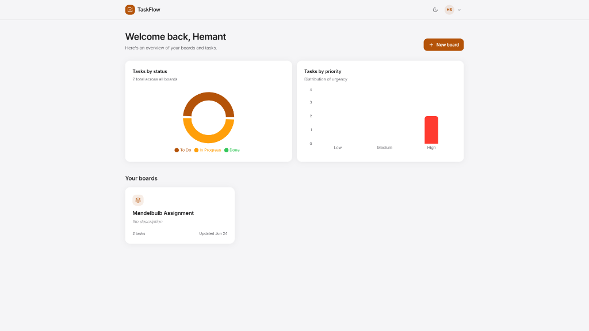
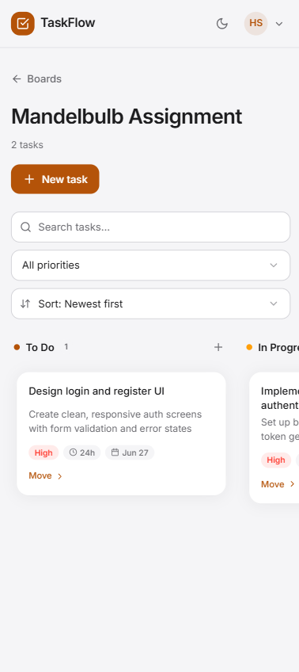
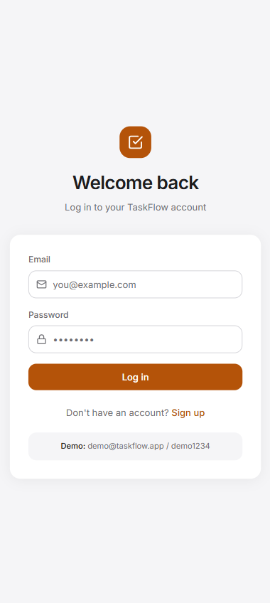
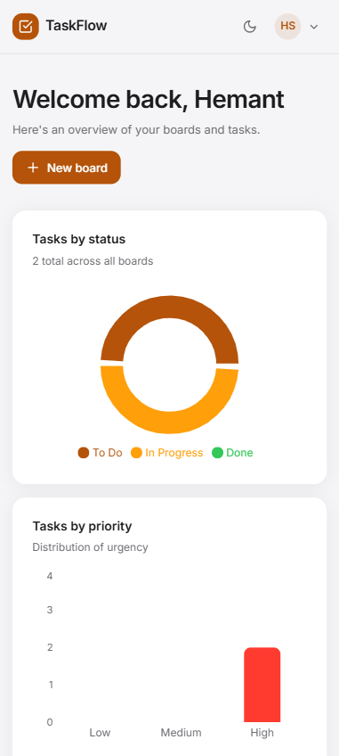

<div align="center">
  
  <h1>TaskFlow</h1>
  <p><strong>Smart Task & Project Manager with AI Estimates</strong></p>

  <p align="center">
    
    
    
    
    
  </p>
</div>

A polished, Trello/Asana-style task manager with an Apple-clean interface. Built as a portfolio-grade full-stack app, TaskFlow lets users register, create boards, organize tasks with drag-and-drop, and get **AI-assisted effort & due-date estimates** for their work.

---

## ✨ Key Features

- **Kanban-Style Boards:** Organize tasks across To Do, In Progress, and Done columns.
- **Drag-and-Drop:** Smoothly reorder tasks or move them between columns using `@dnd-kit`.
- **AI Task Estimation:** Click "✨ Suggest estimate" to let Google Gemini 2.5 Flash predict task effort and suggest a due date based on the task description. (Includes a deterministic offline fallback if the API is unavailable).
- **Apple-Clean UI:** A meticulous, premium design featuring a deep amber accent (`#B45309`), soft shadows, custom animated dropdowns, and micro-interactions.
- **Dark Mode Support:** First-class light and dark mode support toggled easily from the navbar.
- **Dashboard Analytics:** Visual breakdown of tasks by status (Donut chart) and priority (Bar chart) using Recharts.

---

## 📸 Screenshots

### Desktop Experience
<p align="center">
  
  
</p>

### Mobile Experience
<p align="center">
  
  
</p>

---

## 🛠 Tech Stack & Libraries

### Frontend
- **Framework:** React 18 (Vite) — functional components + hooks only, plain JavaScript (ES2022+)
- **Routing:** React Router v6
- **Styling:** Tailwind CSS (class-based dark mode, custom design tokens)
- **Networking:** Axios (single instance with request/response interceptors)
- **Data Visualization:** Recharts (analytics charts)
- **Interactions:** `@dnd-kit/core` + `@dnd-kit/sortable` (drag-and-drop)
- **Icons:** `lucide-react`

### Backend
- **Server:** Node.js + Express.js (REST API)
- **Database:** MongoDB + Mongoose
- **Auth:** `jsonwebtoken` + `bcryptjs`
- **Validation:** `express-validator`
- **AI Integration:** Google Gemini API (`gemini-2.5-flash`), called server-side via REST

---

## 🚀 Local Setup

> Prerequisites: Node.js 18+ and a MongoDB connection string (local `mongodb://localhost:27017/taskflow` or a free MongoDB Atlas cluster).

### 1. Backend (`server/`)

```bash
cd server
npm install
cp .env.example .env        # then edit .env with your values
npm run seed                # optional: creates a demo user + board + tasks
npm run dev                 # starts API on http://localhost:5000
```

### 2. Frontend (`client/`)

```bash
cd client
npm install
cp .env.example .env        # default points at http://localhost:5000/api
npm run dev                 # starts Vite dev server on http://localhost:5173
```

Open **http://localhost:5173** and log in with the demo credentials below (after seeding) or register a new account.

---

## 🔐 Environment Variables

### `server/.env`

| Variable | Required | Description |
| --- | --- | --- |
| `PORT` | No (default 5000) | Port the API listens on |
| `MONGO_URI` | **Yes** | MongoDB connection string (Atlas or local) |
| `JWT_SECRET` | **Yes** | Secret used to sign JWTs |
| `GEMINI_API_KEY` | No | Google Gemini API key. If omitted, the AI feature uses a deterministic offline fallback |
| `FRONTEND_URL` | No (default `http://localhost:5173`) | Allowed CORS origin |

### `client/.env`

| Variable | Required | Description |
| --- | --- | --- |
| `VITE_API_URL` | **Yes** | Base URL of the API, e.g. `http://localhost:5000/api` |

---

## 🤖 AI Feature — Which LLM and Why?

**Model: Google Gemini 2.5 Flash.** Chosen because it has a generous free tier, is fast and low-latency (well-suited to an inline "suggest" button), and reliably returns structured JSON when asked.

**How it works:**
1. The frontend's task modal has a **✨ Suggest estimate** button. It sends `{ title, description }` to `POST /api/ai/suggest`.
2. The backend builds a minimal prompt asking Gemini to reply with **only** JSON: `{ "effort": "S|M|L or 4h", "suggestedDueDate": "YYYY-MM-DD", "reasoning": "..." }`.
3. The call uses `fetch` with an `AbortController` **8-second timeout**.
4. The response is parsed defensively and rendered in a soft highlighted card with **Accept** (autofills the effort + due-date fields) and **Dismiss** buttons.

**Offline Fallback:** If `GEMINI_API_KEY` is missing, the request times out, or parsing fails, the backend returns a **deterministic rule-based estimate** (effort derived from description length; due date offset by priority). The UI shows an **"Offline estimate"** badge instead of breaking.

---

## 📖 API Documentation

All responses use a consistent shape: `{ success: boolean, data?, message?, errors? }`.
Authenticated routes require an `Authorization: Bearer <token>` header.

| Method | Path | Auth | Purpose |
| --- | --- | --- | --- |
| POST | `/api/auth/register` | No | Register (name, email, password) |
| POST | `/api/auth/login` | No | Login, returns JWT + user |
| GET | `/api/auth/me` | Yes | Get the current logged-in user |
| GET | `/api/boards` | Yes | List the user's boards |
| POST | `/api/boards` | Yes | Create a board |
| GET | `/api/boards/:id` | Yes | Get one board (must own it) |
| PUT | `/api/boards/:id` | Yes | Rename/update a board (must own it) |
| DELETE | `/api/boards/:id` | Yes | Delete a board + cascade-delete its tasks |
| GET | `/api/boards/:boardId/tasks` | Yes | List tasks for a board (must own board) |
| POST | `/api/boards/:boardId/tasks` | Yes | Create a task on a board |
| PUT | `/api/tasks/:id` | Yes | Update a task (must own it) |
| PATCH | `/api/tasks/:id/status` | Yes | Move a task between columns |
| DELETE | `/api/tasks/:id` | Yes | Delete a task (must own it) |
| POST | `/api/ai/suggest` | Yes | Get an AI effort/due-date suggestion |
| GET | `/api/health` | No | Health check |

---

## 🧪 Demo / Test Credentials

After running `npm run seed` in `server/`, log in with:
- **Email:** `demo@taskflow.app`
- **Password:** `demo1234`

The seed creates one demo board (“Product Launch”) with tasks spread across all columns to demo immediately.

---

## 🚢 Deployment Notes

The repo is structured for split deployment:
- **Frontend** → Vercel or Netlify (set `VITE_API_URL` to your deployed API URL).
- **Backend** → Render, Railway, or Fly.io (set `MONGO_URI`, `JWT_SECRET`, `GEMINI_API_KEY`, and `FRONTEND_URL`).
- **Database** → MongoDB Atlas.

---

## 🚧 Known Issues & Future Improvements

- **TypeScript migration** — Currently plain JS; types would improve maintainability.
- **Multi-user collaboration** — Boards are currently single-owner only.
- **Activity log** — No history of who changed what and when.
- **Automated backend tests** — No Jest/supertest suite yet.
- **Server-side pagination** — All tasks for a board are loaded at once.
- **Persisted drag reordering** — Reordering within a column is client-side only; only cross-column moves persist.
